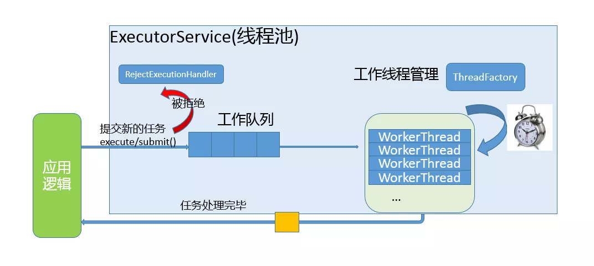

## 线程池原理

1. 任务队列：存储需要处理的任务，由工作的线程来处理任务

   - 通过线程池提供的API函数，将一个待处理的任务添加到任务队列，或者从任务队列中删除

   - 已处理的任务会被从任务队列中删除

   - 线程池的使用者，也就是调用线程池函数往任务队列中添加任务的线程就是生产者线程

2. 工作的线程：任务队列的消费者，n个

   - 线程池中维护了一定数量的工作线程，他们的作用是不停的读任务队列，从任务队列中取出任务并处理
   - 工作的线程相当于任务队列的消费者

3. 管理者线程：不处理任务队列中的任务，1个

   - 它的任务是周期性的对任务队列的任务数量以及处于忙状态的工作线程个数进行检测
   - 当任务过多的时候，可以适当的创建一些新的工作线程
   - 当任务过少的时候，可以适当的销毁一些工作的线程




## 测试

```shell
gcc main.c threadpool.c threadpool.h -o test -lpthread
```

